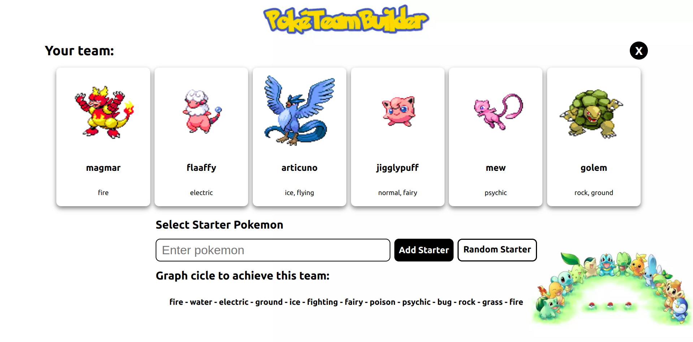

# Grafos1_PokeTeamBuilder
 

# PokeTeamBuilder

**Número da Lista**: 45<br>
**Conteúdo da Disciplina**: Grafos 1<br>

## Alunos
| Matrícula  | Aluno                       |
| ---------- | --------------------------- |
| 19/0036761| Pedro Victor Lima Torreão |
| 17/0114929 | Thiago França Vale Oliveira |

## Sobre
No mundo pokémon, cada um dos monstrinhos possui um ou dois tipos específicos (água, fogo, etc...). cada tipo é fraco quando confronta outro tipo específico, ex: água é fraca contra grama, que é fraca contra fogo que pos sua vez é fraco contra água. Com um total de 18 tipos, vários ciclos de superioridade de tipo são formados.

O projeto consiste em um gerador automático de times pokemón. Após escolher ou sortear um pokémon inicial, é possível gerar um time completo apenas apertando o botão de gerar time. Os times são gerados utilizando um grafo onde os vértices são os tipos pokémon e as arestas suas respectivas fraquezas, dessa forma, o algoritmo irá identificar os vizinhos(fraquezas) do seu pokémon anterior e realizará uma busca para encontrar um pokemon que possua algum tipo vizinho desse tipo forte. Assim, o time será gerado de forma que seu próximo pokémon sempre terá vantagem contra aqueles que tem vantagem sobre seu pokémon anterior. Foi utilizado o algoritimo de Busca em Largura, refinando o sistema que monta o time, dessa forma sempre temos um ciclo fechado, onde ultimo pokemon da equipe tem sua fraqueza baseada na vantagem do primeiro pokemon da equipe.

## Screenshots


*Figura 1: Página principal quando não há nenhum pokemon selecionado*


*Figura 2: Página principal quando o starter já foi selecionado*



*Figura 3: Página principal após a geração do time*

## Vídeo de Apresentação


## Instalação 
**Linguagem**: Javascript<br>
**Framework**: React<br>

### Clonando o repositório

Para clonar o repositório digite:

```console
git clone https://github.com/projeto-de-algoritmos/Grafos1_PokeTeamBuilder2.git
```
### Instalando as dependências

Após clonar o repositório baixe as dependências
```console
yarn install
```
ou
```console
npm i
```
### Executando o programa

Para execurtar o programa execute o comando:
```console
yarn start
```
ou
```console
npm start
```
Após realizar esses passos, a plataforma estará rodando na [porta 3000](http://localhost:3000/)
## Uso 

Para gerar um time basta selecionar seu pokémon inicial, é possível sortear um apertando o botão "Random Starter" ou escrevendo o nome de um pokémon válido no campo e apertar "Add Starter". Após escolher o inicial basta apertar o botão que irá aparecer dizendo "Generate Team".

## Outros 
Os pokémons disponíveis para geração de time vão da primeia até a terceira geração.
